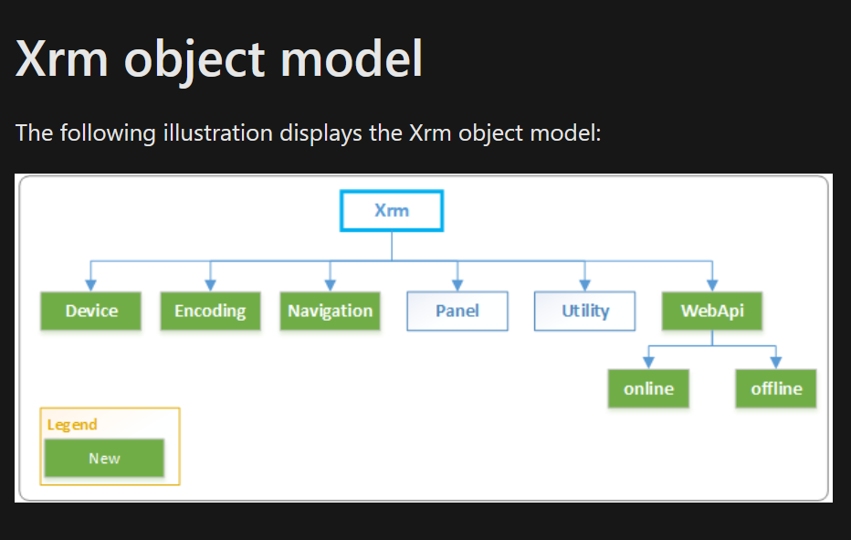
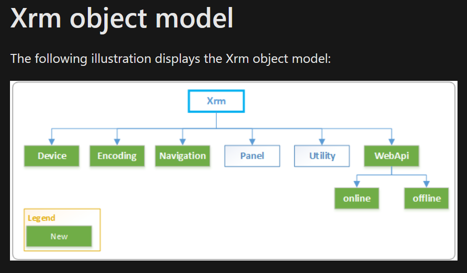
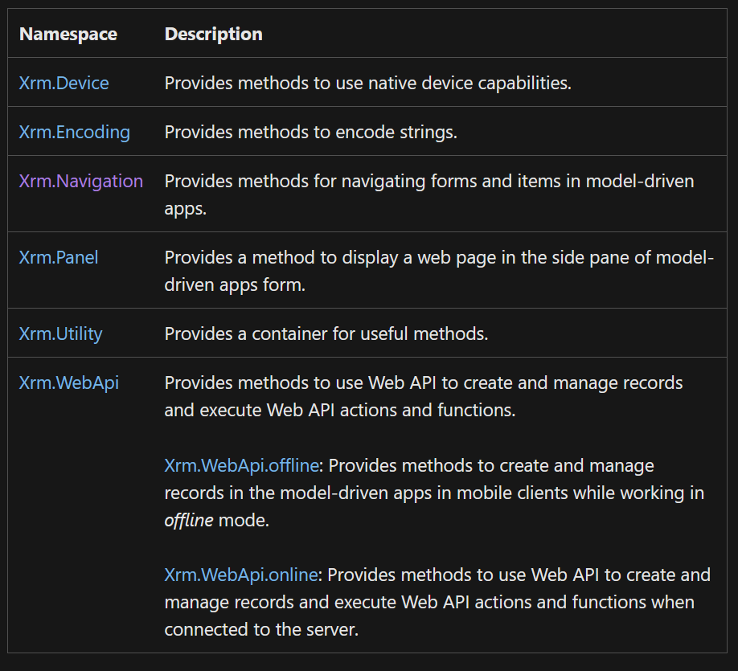
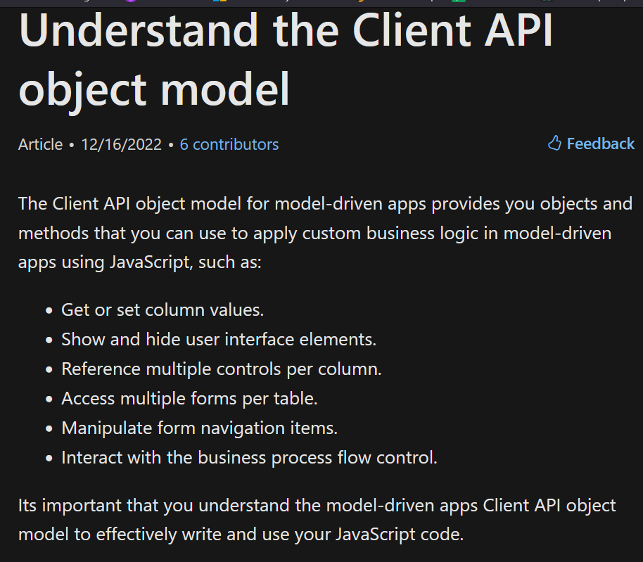

# Javascript notes (similar to business rules)
* Xrm -> el page elly shghalen beha. 
* 
* .getAttribute('attribute name') -> returns the value corresponds to this value. 
* .setRequiredLevel -> bt2oly el field required wla laa. 
* 173030075 -> da id by-map l esm mwgod fe option set. (da el value bta3 el item da fl option set)
* e7na bnfdl el business rule, aktur mn el javascript, l2n el business rule bttnfz fe la7ztha, lakn el javascript mmkn takhud w2t aw keda w mmkn tdkhul gowa queue twela, fa hybt2 el denya. 
* w el C# abta2 baa mn el javascript.
  * fa ehna bnbd2 bl business rules, b3den js, b3den baa el c#
* .getControl -> Control Obj. // search ya batal. 
* lw 3auz t3ml set le value bn7otha ben double qoutes. 
* lakn lw 3auz tgeb el value el gowa el map el corresponding le key mo3yn bnst5dm signel qoutes.
  * example : set name to ahmed
    * set("Ahmed")
  * example: set name to the map which corresponds to the key ahmed 
    * set('ahmed')
* to reload the page we use the refresh function
  * Xrm.Page.data.refresh();
* alert('Alert Message') -> this is an alert function used to alert the user of doing something wrong.

# How can we create a new script to be ran. 
* open any entity. 
* open form
* then press on Form Properties. 
* then select events. (it should be the default page). 
* if you have existing library, select it from the Form Libraries section, else you can press **add** then new to create  a new script. 

# Xrm API object
* 
* 
* 